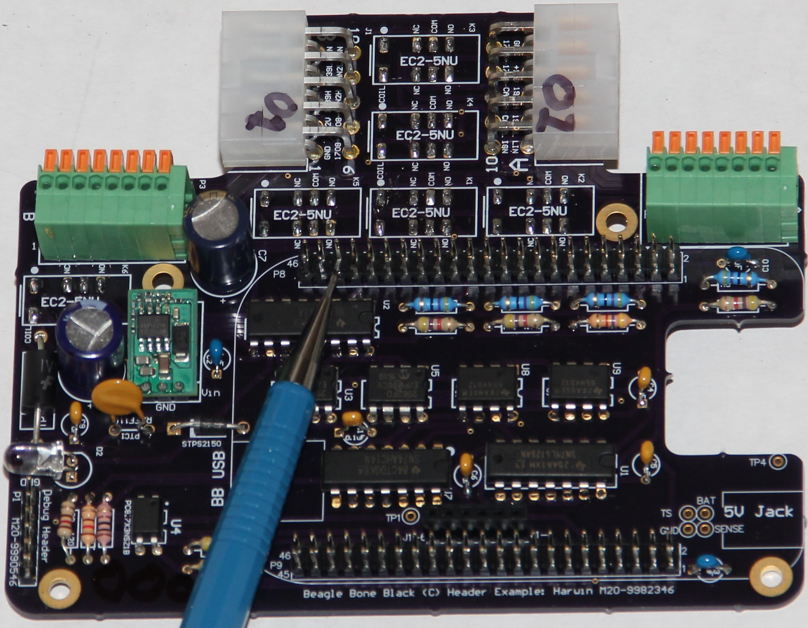
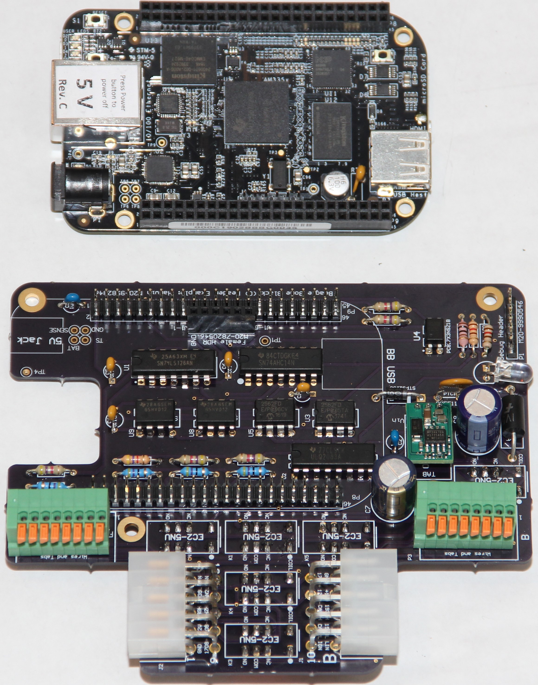
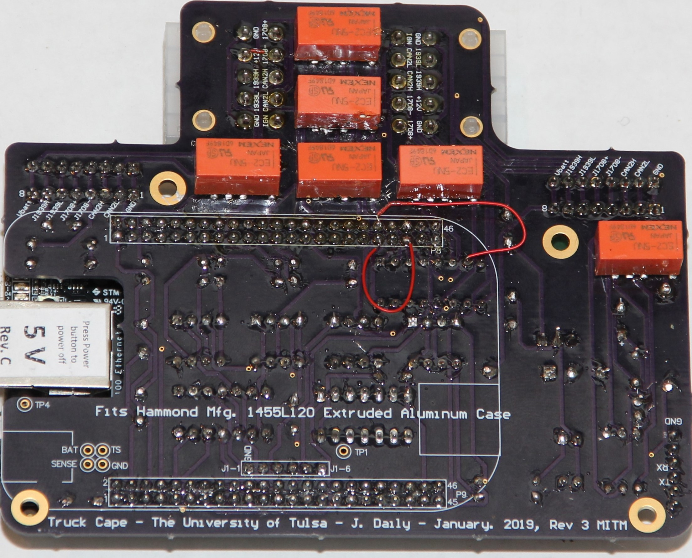

# Truck Cape Revision 3 MITM Hardware
This readme describes how to build the Man-in-the-middle Revison 3.

The circuit was insipired by the Truck Cape, which was inspired by the Truck Duck, which was inspired by the Forensic Link Adapter. 

The  is in PDF format.

## Errata
In hardware version 3 MITM, there are a few issues to address:
  1. The relays need to be mounted on the bottom of the board to get the correct polarity of voltage across the coil. This has been fixed in MITM rev 4.
  2. The pin going to P8_41 needs to be clipped off the header or removed. This is for switch 3. A jumper wire needs to be routed from pin3 of U2 to P8_37, which is GPIO78.
  3. The LED1 net was not connected. Add a jumper wire from P8_38 (GPIO79) to U2 Pin 7. 

Clip pin 41 to ensure the BeagleBone Black will boot. A mechanical pencil shows where pin 41 on P8 is that need to be removed. This pin is routed to P8_37 to be used.

## Build process
All parts are through hole parts. A bill of materials in Excel format is included to help acquire the parts. The silkscreen on the PCB is labeled by part number or value, so hand assembly should be pretty straigh forward. Have a look at some of the photos to see the final product.

### Top View

### Bottom View
The bottom of board shows the relays and the wire tracing.

The printed circuit board was purchased from OSH Park. Since there are issues with the circuit, this is not a shared board. See the Hardware Revision 4 directory to get a new boards made. 

### End Panels
The end connectors are cut with an epilog laser cutter. Each end is cut one side is for the BeagleBone Black and the other side is for the LED and cables.

The pdf used for the laser cutter has a hole for the cord grip and the BeagleBone Black openings. 

The settings on the 40 watt Epilog laser cutter was 17% speed with 100% power and max frequency. The plastic end panels were placed in the upper left corner of the laser cutter facing down. 

## PCBs
If you want your own boards made, you can send a board house these [gerber files](TruckCapeHammondRev3MITM.zip) as a zip file. However, these boards have the issues corrected by the errata built in; it is advised to use a Rev 4 MITM board.

## Top Level Bill of Materials

| Description | Quantity | Manufacturer | Mfg. Part Number | Supplier Link |
|---|---|---|---|---|
| Anodized extruded aluminum enclosure with plastic end panels | 1 | Hammond Mfg. | 1455N1202BK | [Digi-key](https://www.digikey.com/product-detail/en/hammond-manufacturing/1455N1202BK/HM1501-ND/460176) |
| BeagleBone Black Rev C | 1 | GHI Electropnics LLC | BBB01-SC-505-ND | [Digi-key](https://www.digikey.com/product-detail/en/ghi-electronics-llc/BBB01-SC-505/BBB01-SC-505-ND/6210999) |
| Cord Grip or Cable Gland | 2 | Bud Industries | IPG-22211 | [Digi-key](https://www.digikey.com/product-detail/en/bud-industries/IPG-22211/377-2185-ND/5291487) |
| Cable with Dual Headed 9-pin adapters | 2 | Car-link Auto | KL068-04 | N/A |
| Molex 10 pin Mini-fit Jr connectors | 2 | Molex | 39-01-2100 | [Digi-key](https://www.digikey.com/product-detail/en/molex/39-01-2100/WM3704-ND/61385) |
| Circuit Card Assembly | 1 | DG Technologies | DG-MITM | https://www.dgtech.com |

### Circuit Card Assembly
If you want to build one of these for yourself, the printed circuit board is available as an [order from OSH Park](https://oshpark.com/shared_projects/IROrdsvO).

The bill of materials for the circuit card assembly is as follows:

| Comment |  Designator  | Quantity | Manufacturer | PartNumber | Supplier 1 | Supplier Part Number 1 |
| ------- | ------- | ------- | ------- | ------- | ------- | -------  | ------- | ------- |
| BeagleBoneBlack  | BeagleBoneBlack1 |  2 | Sullins Connector Solutions | PREC023DAAN-RC | Digi-Key | S2012EC-23-ND |
| 0.1uF  | C1, C4, C5, C6, C9  | 5 | Vishay BC Components | K104K20X7RH53H5 | Digi-Key | BC5139-ND |
| 1uF  | C2, C3, C10  3 | Murata Electronics North America | RDER72A105K2M1H03A | Digi-Key | 490-9198-1-ND |
| 220uF | C7, C8 |  2 | EPCOS (TDK) | B41858C6227M000 | Digi-Key | 495-6000-ND |
| STPS2150  | D1 | 1 | STMicroelectronics | STPS2150 | Digi-Key | 497-3213-1-ND |
| LED | D2  | 1 | Lite-On Inc. | LTL-4233 | Digi-Key | 160-1130-ND |
| Molex 39-30-1100 | J1, J2  | 2 | Molex | 39-30-1100 | Digi-Key | WM1355-ND |
| EC2-5NU Relay-DPDT  | K1, K2, K3, K4, K5, K6  | 6 | KEMET | EC2-5NU | Digi-Key | 399-11052-5-ND |
|  J1-1 to J1-6 |  P1 || 1 | Sullins Connector Solutions | PPPC061LFBN-RC | Digi-Key | S7039-ND |
| Header 8H |  P2, P3 |  2 | Phoenix Contact | 1789472 | Digi-Key | 277-14044-ND |
| RKEF110 | PTC1 | 1 | Littelfuse Inc. | RKEF110 | Digi-Key | RKEF110HF-ND |
| 4.7k | R1, R2, R3, R6, R7, R11, R13  | 7 | Yageo | CFR-25JB-52-4K7 | Digi-Key | 4.7KQBK-ND |
| 47 | R4, R5, R9, R10  | 4 | Yageo | CFR-25JB-52-47R | Digi-Key | 47QBK-ND |
| 120  | R8, R12  | 2 | Yageo | MFP-25BRD52-120R | Digi-Key | 120ADCT-ND |
| SN74LS126AN  | U1  | 1 | Texas Instruments | SN74LS126AN | Digi-Key | 296-3643-5-ND |
| ULQ2003 Darlington Array | U2  | 1 | Texas Instruments | ULQ2003AN | Digi-Key | 296-22623-5-ND |
| MCP2562 | U3, U5 | 2 | Microchip Technology | MCP2562-E/P | Digi-Key | 296-26344-1-ND |
| LTV-817  U4  | 1 | Lite-On Inc. | LTV-817 | Digi-Key | 160-1366-5-ND |
| OKI-78SR | U6  | 1 | Murata Power Solutions Inc. | OKI-78SR-5/1.5-W36H-C | Digi-Key | 811-2692-ND |
| SN74AHC14N | U7 | 1 | Texas Instruments | SN74AHC14N | Digi-Key | 296-4550-5-ND |
| SN75HVD12  | U8, U9  | 2 | Texas Instruments | SN75HVD12P | Digi-Key | SN75HVD12P |
| TP1.5KE30CA | Z1  | 1 | Littelfuse Inc. | TP1.5KE30CA | Digi-Key | F7610CT-ND |

This bill of materials should match with the schematic labels and the board outlines.

Installing the LED at the end will ensure that it will mate with the hole in the end panel correctly.